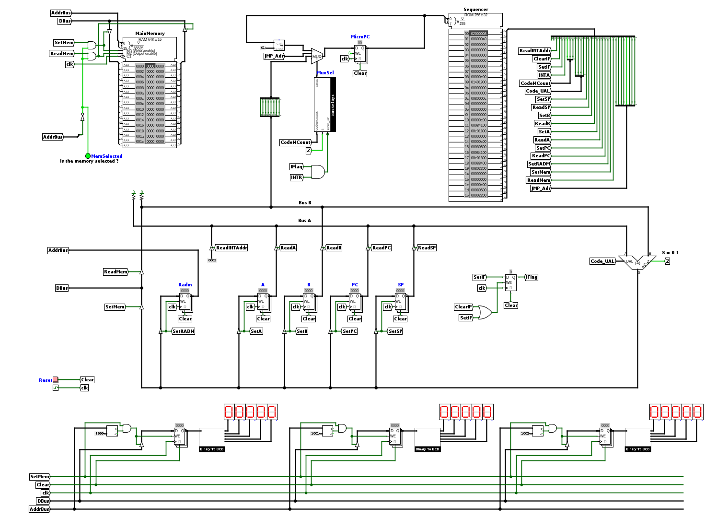
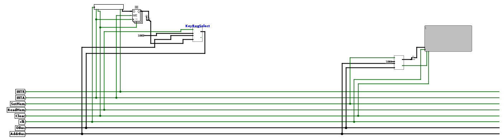

# Interruptions (TP 4)

## Introduction

Jusqu'à maintenant, notre architecture vit dans son monde, elle est quasiment incapable de s'interfacer avec le monde extérieur. Nous avons en vérité déjà vus quelques sorties avec les afficheurs 7 segments mais elle n'est pas sensible à des entrées. On va ici étudier comment ajouter des périphériques d'entrée et être capable de répondre à des événements asynchrones (e.g. l'appui sur un bouton) produits lorsque ces périphériques sont utilisés. On va voir notamment:

- le principe des interruptions
- le codage des gestionnaires d'interruption (interrupt handlers)
- la gestion d'une interruption pendant l'exécution d'un programme

L'architecture que je vous propose d'utiliser est représentée ci-dessous. Vous y verrez notamment l'ajout d'un registre (Interrupt Flag) ainsi que **quatre signaux de contrôle INTA, SetIF, ClearIF, ReadINTAdr**. Vous y verrez également un petit circuit (à côté de la RAM) permettant de générer une interruption lors de l'appui sur un bouton et une modification du contrôle du multiplexeur du MicroPC. Téléchargez le fichier [archi_irq.circ](https://raw.githubusercontent.com/jeremyfix/Architecture/refs/heads/main/TP-Evolution/archi_irq.circ) ainsi que le fichier csmetz.jar à placer dans le même répertoire que [archi_irq.circ](https://raw.githubusercontent.com/jeremyfix/Architecture/refs/heads/main/TP-Evolution/archi_irq.circ). Ouvrez le circuit avec logisim. Chargez la ROM [microcode_irq.rom](https://raw.githubusercontent.com/jeremyfix/Architecture/refs/heads/main/TP-Evolution/Microcodes/microcode_irq.rom) qui contient les micro-instructions des instructions introduites dans le sujet précédent.

Je vous rappelle que vous disposez de la carte de référence de l'architecture. 



## Le principe des interruptions

Le registre Interrupt Flag est là pour autoriser ou non les interruptions. En effet, si, par exemple, le pointeur de pile n'est pas encore initialisé, il ne faut surtout pas partir en interruption puisque c'est justement sur la pile qu'on mémorise le contenu des registres en quittant la routine d'interruption. Au démarrage de la machine, ce registre est à 0, on s'assurera d'autoriser les interruptions après l'initialisation. On introduit deux instructions pour gérer l'état de ce registre ainsi que deux instructions pour partir en interruption et revenir d'une interruption.

| Code Opération (8 bits) | Nom de l'opération | Nombre de mots | Description |
|--|--|--|--|
| 0xd0 | CLI | 1 | Met à zéro le registre Interrupt Flag (IF).<br/><br/>{++IF := 0++}. |
| 0xd4 | STI | 1 | Met à un le registre Interrupt Flag (IF).<br/><br/>{++IF := 1++}. |
| 0xe0 | INT | 1 | Départ en interruption. Le vecteur d'interruption doit être en RAM à l'adresse 0x0002. Cette adresse est chargeable dans le PC via le signal de contrôle {++ReadINTAdr++}. |
| 0xe8 | RTI | 1 | Retour d'une interruption en reprenant le déroulement du programme interrompu. |


On pourrait appeler depuis un programme l'interruption (en invoquant INT) mais on va ici voir comment partir en interruption lors qu'on appui sur le bouton. Si le bouton est pressé, alors INTR = 1. La détection d'une interruption se fait avant l'exécution de chaque instruction du programme principal (à l'adresse 0x00 de la ROM) avec des signaux CodeMCount particulier. Je vous rappelle la sémantique de CodeMCount qui permet de piloter le multiplexeur du MicroPC:

- Si {++CodeMCount=0b000++}, alors {++SMux=MicroPC+1 ++}
- Si {++CodeMCount=0b001++}, alors {++SMux=@Adr ++}
- Si {++CodeMCount=0b010++}, alors {++SMux=InstCode ++}
- Si {++CodeMCount=0b011++} et {++Z=0++}, alors {++SMux=MicroPC+1 ++}
- Si {++CodeMCount=0b011++} et {++Z=1++}, alors {++SMux=@Adr ++}

On y ajoute les codes suivants :

- Si {++CodeMCount=0b100++} et {++INTR & IF=0++}, alors {++SMux=@Adr++}
- Si {++CodeMCount=0b100++} et {++INTR & IF=1++}, alors {++SMux=MicroPC+1++}

Lorsqu'il n'y a pas d'interruption, le MicroPC se branche directement sur l'adresse du Fetch/Decode (0x08), il n'y a donc pas de surcoût à détecter si une interruption est levée ou non. Si il y a une interruption, la prochaine instruction en ROM[0x01] branchera vers les micro-instructions de l'instruction INT (0xe0).

Si une interruption est détectée, il faut gérer l'interruption. La gestion de l'interruption se fait par les micro-instructions à l'adresse 0xe0 (INT). On va supposer ici que notre interruption n'est pas masquable, non interruptible. Aussi, je vous rappelle qu'une interruption doit être gérée de manière transparente pour le programme qui est entrain de tourner, c'est à dire qu'il faut sauvegarder les registres avant de partir vers le programme de l'interruption, qu'il faudra recharger après la routine d'interruption (RTI). Enfin, le programme exécuté lors de l'interruption sera ici par convention à l'adresse 0x0002 en RAM. Le microcode pour INT devra donc :

- mettre à zéro le registre IF, accuser réception de l'interruption (signal de contrôle INTA)
- sauvegarder les registres (A, B, PC) sur la pile
- charger le PC avec l'adresse 0x0002

On dira alors qu'on est en parti en interruption. Les vecteurs d'interruptions seront codés en RAM avec des instructions JMP. En assembleur, le début de votre RAM devra donc ressembler à:

```asm
0x0000	  JMP init
0x0002	  JMP handler
```

avec init l'adresse de votre programme principal et handler l'adresse du programme à exécuter lorsque l'interruption est levée (notez que "JMP handler" doit ici être à l'adresse 0x0002).

Le programme associé à l'interruption s'exécute alors (par exemple, il modifie la valeur d'une variable en RAM). A la fin du programme d'interruption, il faut revenir au programme interrompu en invoquant l'instruction RTI (ReTurn from Interrupt). Il faut donc remettre le chemin de données dans l'état dans lequel il était avant le départ en interruption, c'est à dire:

- récupérer les registres de la pile
- réactiver les interruptions en mettant à un le registre IF

Les étapes de départ en interruption, exécution du programme d'interruption et de retour d'interruption sont illustrées ci-dessous.


!!! question
	
	**Travail à réaliser**

	Commencez par modifier la ROM à l'adresse 0x00 pour ajouter les micro-instructions permettant de sauter à l'adresse INT (0xe0) si une interrution est levée et de sauter à l'adresse des micro-instructions de Fetch/Decode (0x08),

	Définissez le microcode pour les instructions STI (0xd4) , CLI (0xd0),

	Définissez le microcode pour les instructions INT (0xe0) et RTI (0xe8). 

	Testez votre architecture avec le programme suivant [irq_bouton_simple.asm](https://raw.githubusercontent.com/jeremyfix/Architecture/refs/heads/main/TP-Evolution/Progs/irq_bouton_simple.asm), [irq_bouton_simple.mem](https://raw.githubusercontent.com/jeremyfix/Architecture/refs/heads/main/TP-Evolution/Progs/irq_bouton_simple.mem). Le programme principal incrémente un compteur, l'interruption alterne 0, 1 sur le deuxième afficheur

	Pour faciliter votre travail de calcul des micro-instructions, je vous propose
	d'utiliser <br/>
	<button id="showTableBtn" class="md-button md-button--primary">la table de génération de micro-instructions</button>

	<script>
	document.getElementById('showTableBtn').onclick = function() {
		var dataId = 3;
		var dataSp = 1;
		var dataINT = 1;
		console.log("dataid from main: " + dataId);
		openTable(dataId, dataSp, dataINT);
	};
	</script>


Pour faciliter votre travail, je vous propose ci-dessous un outil qui permet des signaux de contrôle du chemin de données au code hexadécimal de la micro-instruction et vice-versa. 

Vous pouvez passer alors à un problème un peu plus compliqué.

!!! question

	Je vous propose aussi le programme [irq_bouton.asm](https://raw.githubusercontent.com/jeremyfix/Architecture/refs/heads/main/TP-Evolution/Progs/irq_bouton.asm), [irq_bouton.mem](https://raw.githubusercontent.com/jeremyfix/Architecture/refs/heads/main/TP-Evolution/Progs/irq_bouton.mem) qui incrémente un compteur réinitialisé (en principe) chaque fois qu'on appui sur le bouton. 

	En pratique, si vous testez bien, ça ne marche pas tout le temps et le compteur n'est pas toujours réinitialisé comme on pense qu'il devrait l'être. 

	Savez-vous pourquoi ? Savez vous modifier le programme pour garantir que le compteur soit correctement réinitialisé ?


## Une application des interruptions : un contrôleur clavier

Je vous propose une application des interruptions en ajoutant un clavier et un écran à notre architecture. On aimerait que les caractères saisis sur le clavier (le clavier s'utilise en tapant des caractères tandis que le clavier est sélectionné avec le poke tool) soient affichés à l'écran. Dans votre architecture archi_irq.circ :

- le clavier est accessible en lecture à l'adresse 0x1003, 
- l'écran est accessible en écriture à l'adresse 0x1004. 



Lorsqu'un caractère est saisi sur le clavier, une interruption est levée. L'interface avec le clavier est faite de telle sorte qu'à la réception du signal INTA, le caractère saisi est transféré dans un registre tampon. 

Pour l'écran, chaque fois qu'on écrit un caractère à l'adresse 0x1004, ce caractère est écrit à la suite des caractères précédents. 

!!! question

	**Travail à réaliser**

	Ecrivez la RAM telle que le programme principal exécute un programme, par exemple incrémente un compteur en affichant le résultat sur un des afficheurs 7 ségments, et l'interruption affiche les caractères saisis au clavier sur l'écran. 


## Gestion de plusieurs interruptions


!!! danger

	sujet à élaborer

	Voir pour s'inspirer du Intel 8259. Sur le principe de ce composant, on pourrait mettre en place un petit
	circuit de logique combinatoire pour accepter, par exemple, 8 lignes
	d'interruptions, avec éventuellement un arbitrage fixé ou tournant (rotating
	priority) et un masquage 

	Le circuit sortirait l'offset du vecteur d'interruption sur l'étiquette
	ReadINTADDr plutôt qu'une adresse fixée en dur à 0x0002
