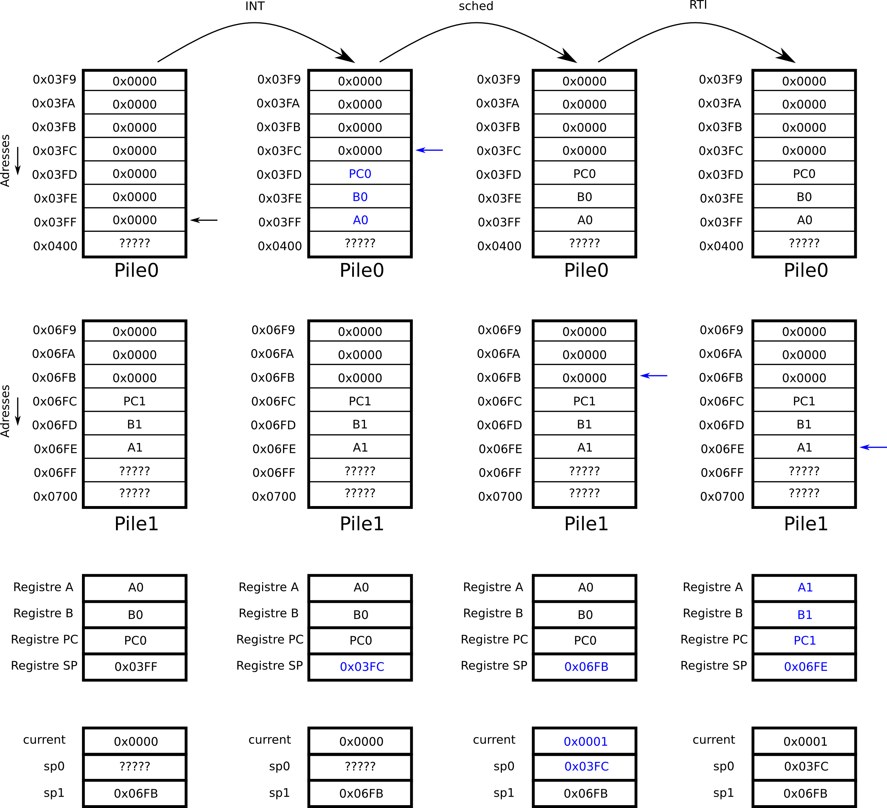

# Programmation assembleur et ordonnancement (TP 5)

## Introduction

Ce sujet contient deux parties. Dans une première partie nous introduisons un assembleur qui permet d'écrire des programmes en langage d'assemblage, ce qui est beaucoup plus pratique que de les écrire en langage machine. C'est un premier pas vers les langages de haut niveau qui rendent l'utilisation d'ordinateur plus confortable. Dans une seconde partie, nous nous intéresserons à l'utilisation des interruptions pour exécuter "en parallèle" plusieurs programmes. Nous n'avons ici plus de nouvelles instructions ni de modification du chemin de données, l'architecture que nous avons construite jusque là dispose de tout ce qu'il nous faut : [archi_irq.circ](https://raw.githubusercontent.com/jeremyfix/Architecture/refs/heads/main/TP-Evolution/archi_irq.circ) et csmetz.jar, [microcode_ordonnanceur.rom](https://raw.githubusercontent.com/jeremyfix/Architecture/refs/heads/main/TP-Evolution/Microcodes/microcode_ordonnanceur.rom).

L'architecture est représentée ci-dessous et je vous rappelle que vous disposez de la carte de référence de l'architecture.


## Programmation assembleur

La programmation en langage machine est assez fastidieuse pour plusieurs raisons :

- il faut se souvenir des codes machines (0x10, 0x14, ..) des instructions qu'il est plus difficile de retenir que les "mnémoniques" (LDAi, LDAd, ...)
- il faut calculer à la main les adresses lors des branchements alors qu'on pourrait baliser un programme d'étiquettes qu'un assembleur réécrirait
- il faut déterminer à la main les adresses ou stocker la pile, les variables globales, .... alors qu'un programme pourrait déterminer l'agencement de la mémoire automatiquement au regard de la taille du programme.

Je vous propose d'introduire un langage d'assemblage ainsi qu'un programme python [assemble.py](https://raw.githubusercontent.com/jeremyfix/Architecture/refs/heads/main/TP-Evolution/ASM/assemble.py) qui convertit le langage d'assemblage en image mémoire à charger directement dans la RAM. Le programme en langage d'assemblage est écrit avec les mnémoniques de la façon suivante :

```asm
LDAi 3
STA  1001
...
```

Chaque ligne contient au plus une instruction. Les valeurs qui suivent les instructions doivent être hexadécimales. Le langage d'assemblage accepte les commentaires, préfixés de ";" :

```asm
LDAi 3  ; ceci est un commentaire : on charge 3 dans le registre A
```

On peut utiliser des étiquettes pour référencer des lignes du programme :

```asm
      JMP init
      JMP bouton
init: LDSPi @stack@
      STI
      LDAi 1
      LDBi 1
loop: ADDA
      STA  1001
      JMP loop
```

Le mot clef "@stack@" est réservé. Il est remplacé, par le script python, par l'adresse de la pile que l'assembleur a calculée. Si vous souhaitez placer la pile vous-même, rien ne vous empêche de ne pas utiliser le mot-clef `@stack@`. Si vous avez besoin de stocker des variables globales en mémoire, vous utiliserez la pseudo instruction `DSW` qui réserve un mot mémoire et lui associe une étiquette :

```asm
DSW compteur
LDAi 0
STA  compteur
```

Par convention, on allouera les variables globales au début du programme, après les vecteurs d'interruptions. Il est interdit d'utiliser des noms de variable ou des étiquettes qui peuvent s'interpréter comme une valeur hexadécimale. Par exemple, vous ne pouvez pas écrire

```asm
DSW ff
```

La disposition en mémoire de la pile et des variables globales est réalisée par notre assembleur assemble.py de la manière suivante :

```asm
...
0x0ffb <--- PILE
0x0ffc <--- PILE
0x0ffd <--- PILE
0x0ffe <--- variable globale 2
0x0fff <--- variable globale 1
0x1000 <--- cette adresse référence le premier afficheur
```

Dans l'exemple ci-dessus, on a supposé que deux variables globales avaient été définies, le pointeur de pile calculé sera alors @stack@=0x0ffd. En effet, l'assembleur s'arrangera toujours pour placer la pile à l'adresse la plus élevée adressable en RAM, avant les variables globales.

Pour traduire le programme assembleur en code machine, on invoquera le script assemble.py en passant en argument le nom du script assembleur et le nom du fichier mémoire cible:

```asm
user@machine:~$ python3 assemble.py monscript.asm monscript.mem
```

Le fichier monscript.mem est alors généré et peut être directement chargé en RAM sauf si des erreurs ont été produites pendant l'assemblage. Par exemple, le programme [un_compteur.asm](https://raw.githubusercontent.com/jeremyfix/Architecture/refs/heads/main/TP-Evolution/ASM/un_compteur.asm) qui incrémente un compteur et l'affiche se réécrit en un_compteur.mem une fois assemblé.


!!! question

	**Travail à réaliser**

	Pour vous faire la main avec la programmation assembleur, je vous propose d'écrire les programmes ci-dessous en assembleur et les traduire en langage machine avec le script python.

	- étendez [un_compteur.asm](https://raw.githubusercontent.com/jeremyfix/Architecture/refs/heads/main/TP-Evolution/ASM/un_compteur.asm) pour prendre en compte les interruptions. Appuyer sur le bouton doit incrémenter un second compteur, indépendant du premier, dont la valeur sera affichée sur le troisième afficheur,
	- réécrivez en assembleur les programmes qui calculent la suite de syracuse et la factorielle

## Ordonnanceur

Supposons que vous ayez besoin d'exécuter plusieurs programmes de manière simultanée, par exemple surfer sur internet en même temps que vous imprimez un document. Vous n'avez certainement pas envie d'attendre que l'impression se termine pour pouvoir récupérer la main sur la machine pour continuer de surfer sur Internet. Comme notre machine est mono-coeur, il faut disposer d'un moyen d'allouer alternativement le chemin de données à l'un et l'autre des programmes à exécuter. C'est le rôle de l'[ordonnanceur](https://fr.wikipedia.org/wiki/Ordonnancement_dans_les_syst%C3%A8mes_d%27exploitation) (scheduler). On va ici voir une version assez frustre d'ordonnancement mais qui donnera néanmoins l'illusion que deux programmes tournent en parallèle. Pour cela, il faut allouer alternativement le processeur à l'un ou l'autre des programmes (on pourrait considérer plus que deux programmes).

Ce qui va nous intéresser ici c'est la commutation de contexte. Le contexte est défini par l'état de tous les registres A, B, PC. En fait, toute l'astuce va consister à changer la valeur du pointeur de pile et les mécanismes introduits jusqu'à maintenant de départ et de retour d'interruption vont faire le reste du travail.

On souhaite exécuter deux programmes qu'on appelle programme0 et programme1.Supposons qu'un premier programme soit entrain de tourner (on verra un peu plus loin comment initialiser le système). Ce programme est entrain de tourner avec sa propre pile, appelons là pile0. Lorsque l'interruption est levée, le départ en interruption sauvegarde les registres sur pile1 puis le vecteur d'interruption sched est appelé. Supposons également que la pile d'un second programme, appelons là pile1 contienne au sommet un contexte (A, B, PC). Si on change la valeur du pointeur de pile de pile0 à pile1, alors le retour d'interruption RTI va dépiler le contexte de pile1 et, ce faisant, reprendre l'exécution du programme1, comme illustré sur la figure ci-dessous : 




Il reste la question de savoir comment initialiser la machine. Pour que l'ordonnanceur puisse faire son travail, il doit disposer de 3 variables :

- current : l'identifiant du programme en cours d'exécution (0 ou 1)
- sp0 : la valeur du pointeur de pile lors de la dernière transition programme0 vers programme1
- sp1 : la valeur du pointeur de pile lors de la dernière transition programme1 vers programme0

Le mot mémoire current indique l'identifiant du programme en cours d'exécution et sp0 et sp1 contiennent les adresses des piles pour les deux programmes. La phase d'initialisation de la machine doit initialiser ces trois mots. Le problème principal dans l'initilisation consiste à s'assurer que, si on commence par lancer programme0, lorsque l'ordonnanceur est réveillé par l'interruption, il y ait un contexte à dépiler dans pile1. Une première approche consiste à empiler des valeurs arbitraires pour les registres A et B et l'adresse du point d'entrée du programme1 qu'on étiquettera main1 et, à la fin de la phase d'initialisation de brancher sur le point d'entrée main0 (JMP main0). Ça marche mais ça n'est pas très élégant parce que l'initialisation de pile0 et de pile1 n'est pas symétrique. Une deuxième solution consiste à voir l'initialisation comme une interruption. On empile alors un contexte (A, B, PC=main0) sur pile0 et (A, B, PC=main1) sur pile1, le pointeur de pile à sp0 et current à 0 et on finit la phase d'initialisation par un retour d'interruption RTI. Avec cette approche, l'initialisation des deux piles est symétrique et le retour d'interruption lance l'exécution du premier programme. La phase d'initialisation donnerait par exemple : 


!!! question

	**Travail à réaliser**

	Ecrivez et testez un programme assembleur qui fait tourner deux programmes :

	- le premier programme incrémente un compteur de 1 en 1 et affiche le résultat sur le premier afficheur
	- le second programme incrémente un compteur de 2 en 2 et affiche le résultat sur le deuxième afficheur

	Pour faciliter votre travail, je vous propose un squelette de mémoire scheduling_squelette.asm.
	Une fois que vous êtes convaincus que votre implémentation fonctionne, modifiez le câblage de l'architecture pour que les interruptions soient générées par un timer plutôt que par le bouton. Le circuit timer.circ permet de générer une interruption à intervalle de temps régulier. N'hésitez pas non plus à remplacer les deux programmes par, par exemple, la factorielle et syracuse.

## Pour aller plus loin

### Programmation assembleur avancée

!!! danger

	proposer quelques exercices de programmation ASM


### Extension de l'ordonnanceur à $N$ processus concurrents

!!! question

	Si vous avez terminé, étendez le principe à l'exécution de N programmes. L'allocation du temps CPU se fera en appliquant l'[algorithme de Round-Robin](https://fr.wikipedia.org/wiki/Round-robin_%28informatique%29).


