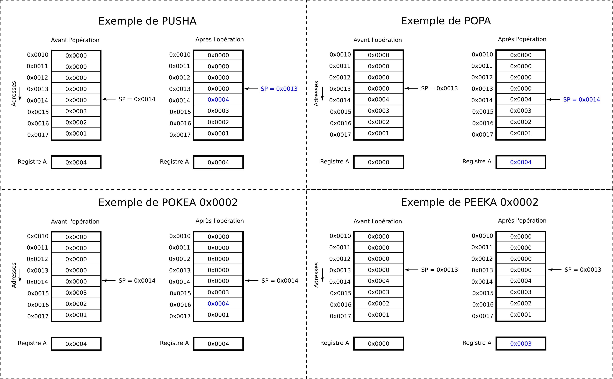
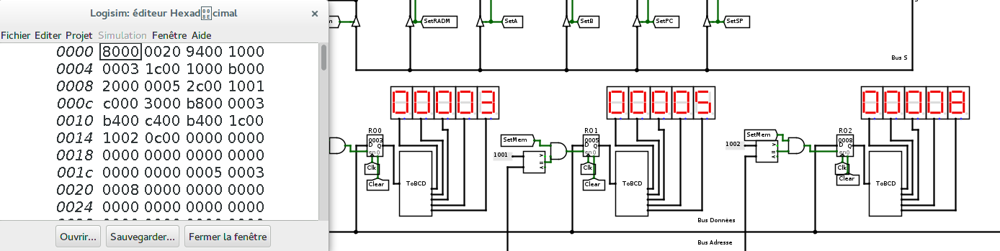

# Pile et appel de routines (TP 3)

 Le but de ce BE est d'étudier une extension de l'architecture des séances précédentes pour gérer l'appel de sous-programmes. On va voir notamment:

- le registre Stack Pointer (SP) et la zone mémoire réservée à la pile dans la RAM
- les instructions permettant de manipuler la pile
- le codage en language assembleur et l'exécution de fonctions récursives

L'architecture que je vous propose d'utiliser est représentée ci-dessous. Vous y verrez notamment l'ajout d'un registre (**Stack Pointer**) ainsi que deux signaux de contrôle {++SetSP++} et {++ReadSP++} qui permettent l'accès en lecture et écriture du registre. 

Téléchargez le fichier [archi_routines.circ]() ainsi que le fichier [csmetz.jar](assets/csmetz.jar) à placer dans le même répertoire que votre circuit. Ouvrez le circuit avec logisim. Chargez la ROM [microcode_routines.rom]() qui contient les micro-instructions des instructions introduites dans le sujet précédent.

!!! danger

	ajouter archi_routines.circ

!!! danger

	ajouter microcode_routines.rom

Je vous rappelle que vous disposez de [la carte de référence de l'architecture](assets/reference_card.pdf). 

!!! danger

	ajouter illustration de l'archi

## Instructions de manipulation de la pile et de son pointeur `PEEK`, `PUSH`, `POP`, `INCSP` et `DECSP`

Le registre de pile (SP , Stack Pointer) est introduit dans le chemin de données. On introduit également de nouvelles instructions qui permettent de gérer la pile.

| Code Instruction (8 bits) | Nom de l'instruction | Nombre de mots | Description |
|--|--|--|--|
| 0x80 | LDSPi | 2 | Charge la valeur de l'opérande dans le registre SP. <br/>{++SP := opérande++}. |
| 0x84 | LDSPd | 2 | Charge la valeur dans la RAM pointée par l'opérande dans le registre SP. <br/>{++SP := Mem[opérande++}. |
| 0x8c | STSP  | 2 | Sauvegarde en mémoire la valeur du registre SP à l'adresse donnée par l'opérande. <br/>{++Mem[opérande] := SP++} |
| 0x90 | INCSP | 1 | Incrémente le pointeur de pile. <br/>{++SP := SP + 1++} |
| 0x94 | DECSP | 1 | Décrémente le pointeur de pile. <br/>{++SP := SP - 1++} |
| 0xb0 | PUSHA | 1 | Empile le registre A. <br/>{++Mem[SP] := A; SP := SP - 1++} |
| 0xb4 | POPA  | 1 | Dépile le registre A. <br/>{++SP := SP + 1; A := Mem[SP]++} |
| 0xb8 | POKEA | 2 | Sauvegarde le registre A dans la pile. <br/>{++Mem[SP+operande] := A++} |
| 0xbc | PEEKA | 2 | Récupère le registre A dans la pile. <br/>{++A := Mem[SP + operande]++} |
| 0xc0 | PUSHB | 1 | Empile le registre B. <br/>{++Mem[SP] := B; SP := SP - 1++} |
| 0xc4 | POPB  | 1 | Dépile le registre B. <br/>{++SP := SP + 1; B := Mem[SP]++} |
| 0xc8 | POKEB | 2 | Sauvegarde le registre B dans la pile. <br/>{++Mem[SP+operande] := B++} |
| 0xcc | PEEKB | 2 | Récupère le registre B dans la pile. <br/>{++B := Mem[SP + operande]++} |

Il est important de s'assurer qu'après chaque instruction (non pas micro-instruction bien sûr), le pointeur de pile pointe la prochaine zone mémoire libre de la pile. Je vous rappelle aussi que la pile augmente dans le sens des adresses décroissantes; c'est la raison pour laquelle, par exemple, récupérer une variable dans la pile (PEEKA ou PEEKB) se fait en ajoutant un décalage au pointeur de pile. Tout ça est illustré ci-dessous. 



!!! question

	Ecrivez les micro-instructions des instructions ci-dessus. 

	Pour faciliter votre travail, je vous propose ci-dessous un outil qui permet de passer des signaux de contrôle du chemin de données au code hexadécimal de la micro-instruction et vice-versa. 

	<button id="showTableBtn" class="md-button md-button--primary">Table de génération de micro-instructions</button>

	Vous remarquerez l'introduction de deux champs pour contrôler le registre de pointeur de pile (SP). 

<script>
document.getElementById('showTableBtn').onclick = function() {
    var dataId = 1;
	var dataSp = 1;
	var dataINT = 0;
	console.log("dataid from main: " + dataId);
    openTable(dataId, dataSp, dataINT);
};
</script>


!!! question

	Testez votre architecture avec le programme [stack.mem](). Si tout se passe bien, vos afficheurs et votre RAM (regardez bien les adresses 0x1e, 0x1f et 0x20) devraient donner : 

	

!!! danger 

	ajouter le prog stack.mem de test

!!! tip

	N'hésitez pas à retranscrire le code machine en utilisant le nom des opérations pour plus facilement découvrir ce que ces programmes doivent faire. Par exemple :

	```
	8000 20
	9400
	1000 3
	1c00 1000
	b000
	...	
	```

	peut se voir de manière équivalente comme :

	```asm
	LDSPi 0x0020
	DECSP
	LDAi  0x0003
	STA   0x1000
	PUSHA
	...
	```

## Instructions de départ et retour de routines `CALL` et `RET`

On va maintenant voir une utilisation intéressante de la pile lors de l'appel de routines, et en particulier le passage d'arguments et de la valeur de retour d'une routine. Il nous suffit d'introduire deux instructions pour l'appel d'une routine ({++CALL++}) et le retour d'une routine ({++RET++}) : 

| Code Instruction (8 bits) | Nom de l'instruction | Nombre de mots | Description |
|--|--|--|--|
| 0xa0 | CALL | 2| Empile le compteur de programme (PC) et branche à l'adresse de la routine fournie par l'opérande |
| 0xa8 | RET  | 2| Dépile le compteur de programme (PC) de la pile |


Pour se rappeler la manière dont l'appel de routine fonctionne, je vous propose de considérer l'appel d'une fonction :

```
f(a, b) = a + b
```

Cette fonction doit disposer des opérandes "a" et "b", calculer son opération et retourner le résultat au programme appelant. En supposant par example que le programme appelant appelle f(7,8), on aurait par exemple le code suivant en RAM, ici écrit en assembleur pour être plus lisible:

```asm
# Programme appelant :
0x0000     LDSPi 0x0030
0x0002     DECSP          # On réserve de la place dans la pile pour la valeur de retour
0x0003     LDAi  0x0007
0x0005     PUSHA          # On charge la première opérande
0x0006     LDAi  0x0008
0x0008     PUSHA          # On charge la deuxième opérande
0x0009     CALL 0x0020    # On appelle la routine
0x000b     POPA           # On enlève la deuxième opérande de la pile
0x000c     POPA           # On enlève la première opérande de la pile
0x000d     POPA           # On récupère le résultat
0x000e     STA  0x1000    # On affiche le résultat
0x0010     END            # Fin de programme

# Routine à l'adresse 0x0020:
0x0020     PEEKA 0x0003   # On récupère la première opérande
0x0022     PEEKB 0x0002   # On récupère la seconde opérande
0x0024     ADDA           # On en fait la somme
0x0025     POKEA 0x0004   # On sauvegarde le résultat
0x0027     RET            # On retourne au programme appelant
```

Pour qu'à la sortie de la routine (RET), on sache quelle adresse charger dans le compteur de programme (PC), l'instruction CALL sauvegarde la valeur courante du PC après avoir lu son opérande, i.e. l'adresse de l'instruction qui suit le CALL. Il faut bien faire attention à prendre en compte que l'adresse de retour est mise dans la pile lorsqu'on calcule les décalages des instructions PEEK et POKE. En image, ça nous donne une évolution de la pile ci-dessous :


L'adresse de retour empilée par le CALL est la valeur du PC après lecture de l'opérande du CALL. Lorsqu'on exécute les micro-instructions du CALL, le PC pointe sur son opérande; Faites donc bien attention à sauvegarder l'adresse de retour PC+1 dans la pile. 


!!! question

	Je vous propose le travail suivant :

    - introduisez les micro-instructions pour les instructions CALL (0xa0) et RET (0xa8),
    - programmez votre RAM pour exécuter l'exemple illustratif ci-dessus et tester votre implémentation.
	
	Pour vous aider dans votre travail , pensez à utiliser la :

	<button id="showTableBtn" class="md-button md-button--primary">Table de génération de micro-instructions</button>

<script>
document.getElementById('showTableBtn').onclick = function() {
    var dataId = 2;
	var dataSp = 1;
	var dataINT = 0;
	console.log("dataid from main: " + dataId);
    openTable(dataId, dataSp, dataINT);
};
</script>

Une fois que vous êtes assurés que votre architecture est fonctionnelle, je vous propose deux exercices . 

!!! danger

	prévoir de guider pour la vérification que ça marche comme prévu

!!! question

	Pour commencer je vous propose de programmer une généralisation des suites de Syracuse (ou de Collatz)

	$$\begin{eqnarray}
	u(n+1) &=& f(u(n), a, b)\\
	f(u, a, b) &=& \begin{cases} \frac{u}{2} & \text{ si } u \text{ est pair } \\
	a u + b & \text{ sinon } \end{cases}
	\end{eqnarray}$$

	Je vous propose d'écrire un programme permettant de calculer les valeurs de cette suite en écrivant une routine pour la fonction "f".

!!! question

	Ecrivez également une routine qui calcule la factorielle d'un nombre et utilisez le pour calculer $8!$. Pour rappel : 

	$$
	fac(n) = \begin{cases} 1 & \text{ si } n = 0\\
	n fac(n-1) & \text{ sinon } \end{cases}
	$$

	On voit donc que, si n est non nul, le résultat de fact(n) est calculé à partir du résultat de fact(n-1); nous avons donc ici une **fonction récursive**. 

