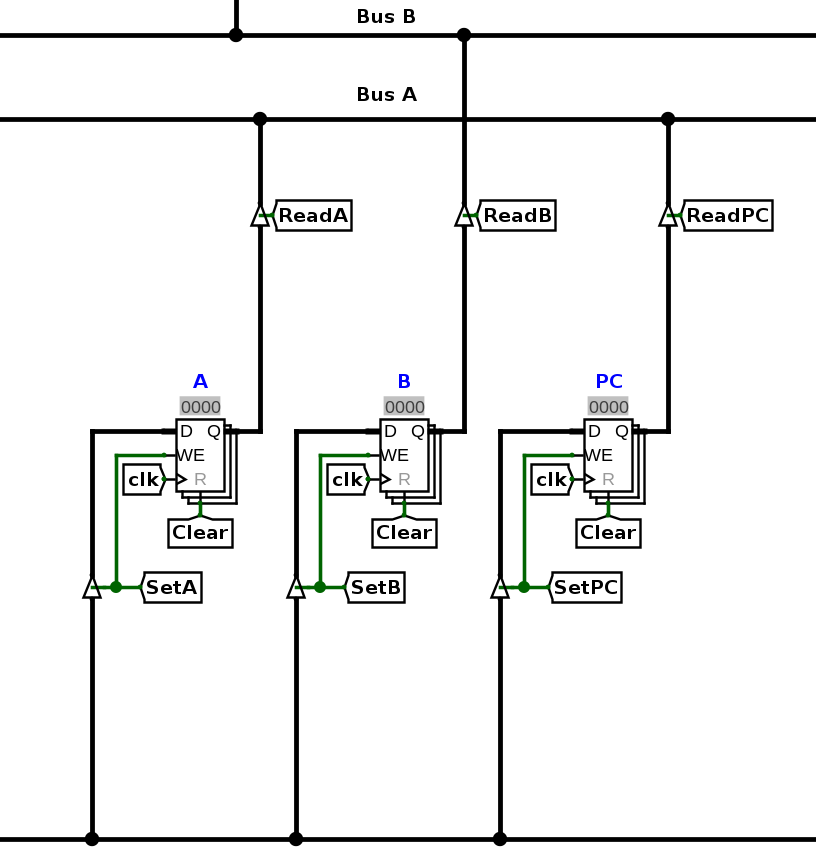

# Séquence micro-programmé (TP 2)

## Introduction

Le but de ce TL est de réaliser un séquenceur micro-programmé pour piloter notre architecture représentée ci-dessous. Nous allons voir qu'un nouveau composant est introduit, une ROM, et votre travail consiste alors à écrire le micro-code de quelques instructions dans cette ROM. Plusieurs programmes vous sont fournis pour tester votre réalisation et vous aurez également à écrire vos propres programmes en code machine. Lancez logisim et chargez l'architecture [archi_sequenceur.circ](https://raw.githubusercontent.com/jeremyfix/Architecture/refs/heads/main/TP-Evolution/archi_sequenceur.circ) ainsi que le fichier [csmetz.jar](assets/csmetz.jar) à placer dans le même répertoire que [archi_sequenceur.circ](https://raw.githubusercontent.com/jeremyfix/Architecture/refs/heads/main/TP-Evolution/archi_sequenceur.circ). Lisez ensuite la présentation ci-dessous avec l'architecture sous les yeux.

La mémoire RAM contient des mots de 16 bits et est adressable sur 16 bits et a donc une capacité de 128 Ko. Les opérandes et les adresses sont codées sur 16 bits. Les instructions sont codées sur un ou deux mots de 16 bits : le premier mot contient le code de l'opération et l'éventuel mot suivant contient l'opérande. Le code de l'opération est codé dans les 8 bits de poids fort d'un mot. Ce qui se résumé sur le tableau ci-dessous donnant la sémantique des bits d'un ou deux mots de 16 bits.

<table class="codeop">
	  <thead>
	    <tr><th>15</th><th>14</th><th>13</th><th>12</th><th>11</th><th>10</th><th> 9</th><th> 8</th><th> 7</th><th> 6</th><th> 5</th><th> 4</th><th> 3</th><th> 2</th><th> 1</th><th> 0</th></tr>
	  </thead>
	  <tr><td colspan="8">Code de l'opération</td><td colspan="8"> -- bits inutilisés -- </td></tr>
</table>
<table class="codeop">
	  <thead>
	    <tr><th>15</th><th>14</th><th>13</th><th>12</th><th>11</th><th>10</th><th> 9</th><th> 8</th><th> 7</th><th> 6</th><th> 5</th><th> 4</th><th> 3</th><th> 2</th><th> 1</th><th> 0</th></tr>
	  </thead>
	  <tr><td colspan=16>Opérande (optionelle)</td></tr>
</table>

Les instructions à disposition sont listées dans la table ci-dessous :

| Code opération (8 bits) | Nom de l'opération | Nombre de mots | Description |
|--|--|--|--|
| 0x0c | END | 1 | Fin de programme |
| 0x10 | LDAi | 2 | Charge la valeur de l'opérande dans le registre A   {++[A := operande]++} |
| 0x14 | LDAd | 2 | Charge la valeur dans la RAM pointée par l'opérande dans le registre A.  {++[A := Mem[opérande]]++} |
| 0x18 | - | - | - |
| 0x1c | STA | 2 | Sauvegarde en mémoire la valeur du registre A à l'adresse donnée par l'opérande.  {++[Mem[opérande] := A]++} |
| 0x20 | LDBi | 2 | Charge la valeur de l'opérande dans le registre B  {++[B := operande]++} |
| 0x24 | LDBd | 2 | Charge la valeur dans la RAM pointée par l'opérande dans le registre B.  {++[B := Mem[opérande]]++} |
| 0x28 | - | - | - |
| 0x2c | STB | 2 | Sauvegarde en mémoire la valeur du registre B à l'adresse donnée par l'opérande.  {++[Mem[opérande] := B]++} |
| 0x30 | ADDA | 1 | Ajoute le contenu des registres A et B et mémorise le résultat dans le registre A.  {++[A := A + B]++} |
| 0x34 | ADDB | 1 | Ajoute le contenu des registres A et B et mémorise le résultat dans le registre B.  {++[B := A + B]++} |
| 0x38 | SUBA | 1 | Soutstrait le contenu des registres A et B et mémorise le résultat dans le registre A.  {++[A := A - B]++} |
| 0x3c | SUBB | 1 | Soutstrait le contenu des registres A et B et mémorise le résultat dans le registre B.  {++[B := A - B]++} |
| 0x40 | MULA | 1 | Multiplie le contenu des registres A et B et mémorise le résultat dans le registre A.  {++[A := A x B]++} |
| 0x44 | MULB | 1 | Multiplie le contenu des registres A et B et mémorise le résultat dans le registre B.  {++[B := A x B]++} |
| 0x48 | DIVA | 1 | Divise le contenu du registre A par deux et mémorise le résultat dans A.  {++[A := A / 2]++} |
| 0x4c | - | - |
| 0x50 | ANDA | 1 | Calcule un ET logique entre le contenu des registres A et B et mémorise le résultat dans A.  {++[A := A & B]++} |
| 0x54 | ANDB | 1 | Calcule un ET logique entre le contenu des registres A et B et mémorise le résultat dans B.  {++[B := A & B]++} |
| 0x58 | ORA  | 1 | Calcule un OU logique entre le contenu des registres A et B et mémorise le résultat dans A.  {++[A := A | B]++} |
| 0x5c | ORB  | 1 | Calcule un OU logique entre le contenu des registres A et B et mémorise le résultat dans B.  {++[B := A | B]++} |
| 0x60 | NOTA | 1 | Mémorise dans A la négation de A.  {++[A := !A]++} |
| 0x64 | NOTB | 1 | Mémorise dans B la négation de B.  {++[B := !B]++} |
| 0x68 | - | - | 
| 0x6c | - | - |
| 0x70 | JMP | 2 | Saute inconditionnellement à l'adresse donnée par l'opérande.  {++[PC := operande]++} |
| 0x74 | JZA | 2 | Saute à l'adresse donnée par l'opérande si le contenu du registre A est nul.  {++[PC := operande si A=0]++} |
| 0x78 | JZB | 2 | Saute à l'adresse donnée par l'opérande si le contenu du registre B est nul.  {++[PC := operande si B=0]++} |
| 0x7c | - | - | 

## Présentation du chemin de données

Le chemin de données est constitué de différents éléments que je vous propose de détailler.

### Mémoire RAM

La mémoire contient les instructions et les données du programme à exécuter. Elle est adressable par le registre RADM (Registre d'Adresse Mémoire); Pour lire la mémoire, il faut d'abord placer l'adresse du mot mémoire à lire dans le registre d'adresse mémoire (RADM). Pour cela, il faut placer l'adresse sur le bus S, activer le registre d'adresse mémoire `SetRADM=1` et activer un front montant d'horloge. En mettant la mémoire en lecture `ReadMem=1`, le mot mémoire à l'adresse contenue dans le registre RADM est immédiatement disponible sur la sortie.

{width=40%}

Pour modifier le contenu de la mémoire, il faut d'abord mettre dans le registre d'adresse mémoire (RADM) l'adresse à laquelle l'information doit être stockée. Ensuite, il faut placer l'information à stocker sur le bus S, mettre la mémoire en mode écriture {++SetMem=1++} et activer un front montant d'horloge. Le mot disponible sur l'entrée D sera alors sauvegardée à l'adresse contenue dans le registre RADM au prochain front montant d'horloge. 

## Adressage des afficheurs 7 segments

{width=60%}

 L'utilisation des afficheurs 7 segments se fait en adressant la mémoire à des adresses particulières. Les adresses, sur 16 bits, inférieures strict à 0x1000 adressent la RAM; Les trois afficheurs ont respectivement les adresses {++0x1000++}, {++0x1001++} et {++0x1002++}. Pour afficher une valeur sur le premier afficheur, il faut placer l'adresse 0x1000 dans le registre RADM, puis faire comme si on sauvegardait une valeur en mémoire : placer la valeur sur le bus S, mettre la mémoire en écriture (SetMem) et déclencher un front montant d'horloge.

Le composant combinatoire ToBCD (Binaire Codé Décimal) assure la traduction d'un entier codé en binaire sur 16 bits en son codage BCD sur 20 bits pour ensuite afficher chacun des 5 chiffres sur un afficheur 7 segments. Pour information, ce composant peut implémenter l'algorithme du [double dabble](https://fr.wikipedia.org/wiki/Double_dabble).

## Unité Arithmétique et Logique

 L'unité arithmétique et logique reçoit ses opérandes des bus A et B. Son opération est définie par l'état de l'entrée {++Code_UAL++}. L'UAL est un circuit combinatoire donc lorsque le code opération est définie, la sortie est "immédiatement" disponible (en réalité, modulo le temps de transit des signaux dans l'UAL). L'UAL comporte également 3 indicateurs Z, C, V:

- Z : indicateur de résultat nul, {++Z=1 si S=0++}
- C : indicateur de retenue, C=1 si une retenue apparaît lors du calcul de S
- V : indicateur de débordement, V=1 si le calcul de S produit un débordement

{width=40%}

L'UAL fournit 11 opérations décrites dans la table ci-dessous

| Code UAL (4 bits) | Opération |
|--|--|
| 0000 | S = A |
| 0001 | S = B |
| 0010 | S = A ET B |
| 0011 | S = A OU B |
| 0100 | S = non(A) |
| 0101 | S = non(B) | 
| 0110 | S = A + B |
| 0111 | S = A - B | 
| 1000 | S = A + 1 | 
| 1001 | S = A - 1 |
| 1010 | S = A x B |
| 1011 | S = A >> 1 |

## Registres d'opérandes et Program Counter

Les registres A, B et program counter sont accessibles en lecture et en écriture. Pour écrire dans ces registres, il suffit de placer une valeur sur le bus S, de les activer {++SetA, SetB, SetPC++} et de déclencher un front montant d'horloge. Pour lire les données, il suffit d'activer les portes de sorties, {++ReadA, ReadB, ReadPC++}. Attention, les registres A et PC mettent leur sortie sur le bus A mais le registre B sort sur le bus B.

{width=40%}

## Séquence microprogrammé

 Le séquenceur microprogrammé reçoit en entrée le code de l'instruction sur 8 bits (les 8 bits du poids fort du mot mémoire). Programmer le séquenceur consiste à définir la séquence des signaux (micro-instructions) pilotant le chemin de données pour chacune des instructions. La code de l'instruction (e.g. 0x10 pour LDAi) adresse directement la ROM de telle sorte que la séquence de micro-instructions pour l'instruction LDAi commence à l'adresse 0x10 de la ROM. Comme vous pouvez le remarquer, entre chaque code instruction, il y a un offset de 4 mots, ce qui veut dire que vous devez coder chaque instruction par une séquence d'au plus 4 micro-instructions. Pour remplir la ROM, il suffit de faire un clic droit sur la ROM et d'aller dans le menu "Edit Content". Attention: dans la version de logisim que nous utilisons le copier/coller est buggé; le contenu collé est malheureusement toujours collé en début de mémoire. Vous avez la possibilité d'éditer le fichier mémoire avec un éditeur de texte et de charger son contenu ensuite dans la ROM (clic droit sur la ROM, "Load image"). On va revenir sur ce point dans la partie "Conseil de mise en oeuvre" à la fin du sujet.

La disposition des instructions dans la ROM vous est imposée.

- A l'adresse 0x00, vous devez sauter à l'adresse 0x08 qui contient les micro-instructions pour les phases de Fetch/Decode. Nous utiliserons dans un sujet ultérieur cette zone mémoire différemment, pour y placer les interruptions,
- A l'adresse 0x08 se trouvent les micro-instructions de la phase de Fetch/Decode,
- A l'adresse 0x0c se trouvent les micro-instructions pour l'instruction END,
- A l'adresse 0x10 se trouvent les micro-instructions pour l'instruction LDAi, 
- puis à l'adrese 0x14 pour l'instruction LDAd, 
- etc..

{width=80%}

Une micro-instruction est un mot sur 32 bits, les 24 premiers bits pilotant le chemin de données, les 8 derniers bits codant une adresse essentiellement utilisée pour les branchements. Schématiquement, une micro-instruction a donc le format suivant : 

Il nous reste à expliquer le rôle du champ sur 3 bits CodeMCount et de l'adresse sur 8 bits Adr. Les 3 bits CodeMCount sont combinés avec la sortie Z de l'UAL pour piloter le multiplexeur en entrée du registre d'adresse de micro-instruction MicroPC. Notons SMux la sortie du multiplexeur, le composant qui interface CodeMCount, Z et le multiplexeur agit ainsi: 

- Si {++CodeMCount=0b000++}, alors {++SMux=MicroPC+1++}
- Si {++CodeMCount=0b001++}, alors {++SMux=@Adr++}
- Si {++CodeMCount=0b010++}, alors {++SMux=InstCode++}
- Si {++CodeMCount=0b011++} et {++Z=0++}, alors {++SMux=MicroPC+1++}
- Si {++CodeMCount=0b011++} et {++Z=1++}, alors {++SMux=@Adr++}

Le registre micro PC est au séquenceur en ROM ce que le program counter est au programme en RAM : il permet de l'adresser et de savoir quelle micro-instruction exécuter. Pour certaines instructions (e.g. JZA), il est nécessaire de sauter plusieurs mots dans la ROM. Pour simplifier le nombre de composants, il a été choisi de préciser dans la micro-instruction l'adresse du saut:

- pour ce TP, la première micro-instruction de la ROM, i.e. à l'adresse 0x00, doit faire sauter le micro PC à l'adresse des microinstructions de fetch/decode : {++CodeMCount=0b001, @Adr=0x08 soit ROM[0x00]=0x00800008++}
- il ne faudra pas oublier de retourner à l'adresse 0x00 à la fin d'une séquence de micro-instruction
- pour les sauts conditionnels JZA, JZB, on devra utiliser le champ @Adr de la micro-instruction si le test est vrai

!!! example 

	Prenons par exemple l'instruction de chargement immédiat dans le registre A (LDAi, code:0x10). Pour exécuter cette instruction, il faut:

	- Charger dans le registre d'adresse mémoire le contenu du registre PC ({++ReadPC=1, Code UAL=0000++} qui correspond à l'opération S=A, {++SetRADM=1++}). Le code de la microinstruction associée est donc {++0x00000c00++}
	- Mettre la mémoire en mode lecture ({++ReadMem = 1++}), diriger l'entrée B vers la sortie S ({++Code UAL=0001++}) et activer le registre A en écriture ({++SetA = 1++}). Le code de la microinstruction associée est donc {++0x00084100++}
	- Enfin, il faut incrémenter le program counter ({++ReadPC=1, CodeUAL=1000, SetPC=1++}) et mettre dans le registre micro PC l'adresse du début de la ROM ({++Adr=0x00, CodeMCount=001++}). Le code de la microinstruction associée est donc {++0x00c01800++}

	L'instruction LDA immédiat nécessite donc 3 micro-instructions : {++0x00000c00, 0x00084100, 0x00c01800++}.

## Travail à réaliser : programmation des micro-instructions

On vous demande d'écrire le microcode dans la ROM pour chacune des 23 instructions présentées un peu plus haut. La méthode consiste à prendre les instructions les unes après les autres et à écrire la séquence de codes hexadécimaux permettant de réaliser l'instruction. Ces codes hexadécimaux permettent de configurer le chemin de données. Les codes d'instructions, d'UAL, ... sont listés précédemment et également synthésisés dans la [carte de référence](assets/reference_card.pdf).

Pour faciliter votre travail de calcul des micro-instructions, je vous propose
d'utiliser <button id="showTableBtn" class="md-button md-button--primary">la table de génération de micro-instructions</button>

Comme expliqué dans la partie ci-dessous "Conseils de mise en oeuvre", vous partirez du fichier mémoire [microcode_seq.rom](https://raw.githubusercontent.com/jeremyfix/Architecture/refs/heads/main/TP-Evolution/Microcodes/microcode_seq.rom). Vous remarquerez que la première micro-instruction est déjà mentionnée, elle permet de sauter dans la ROM à l'adresse des micro-instructions du Fetch/Decode. Les micro-instructions pour l'instruction END sont également déjà mentionnées. Pour pouvoir tester les séquences de micro-instruction que vous allez définir, vous trouverez ci-dessous quelques programmes à charger dans la RAM. Il faudra toujours cliquer sur le bouton "Clear" en haut du circuit pour remettre les registres dans leur état initial avant de tester un programme.

!!! question

	Je vous propose de coder les instructions dans l'ordre suivant :

	- renseignez les micro-instructions pour la phase de Fetch/Decode en commençant à l'adresse 0x08
	- renseignez les micro-instructions pour les instructions LDAi et STA et testez votre architecture avec le programme [LDAiSTA.mem](https://raw.githubusercontent.com/jeremyfix/Architecture/refs/heads/main/TP-Evolution/Progs/LDAiSTA.mem). Vous devriez voir 2025 sur le premier afficheur (pourquoi?),
	- renseignez les micro-instructions pour l'instructions LDAd et testez votre architecture avec le programme [LDAdSTA.mem](https://raw.githubusercontent.com/jeremyfix/Architecture/refs/heads/main/TP-Evolution/Progs/LDadSTA.mem). Vous devriez voir 2025 sur le premier afficheur (pourquoi?),
	- renseignez les micro-instructions pour les instructions LDBi, LDBd, STB, ADDA et testez votre architecture en écrivant vous même un fichier mémoire de test,
	- renseignez les micro-instructions pour les instructions arithmétiques SUB, MUL, .. et logiques AND, OR, .. et adaptez les codes donnés précédemment pour tester votre architecture,
	- renseignez les micro-instructions pour le saut inconditionnel JMP et testez votre architecture avec le programme [JMP.mem](https://raw.githubusercontent.com/jeremyfix/Architecture/refs/heads/main/TP-Evolution/Progs/JMP.mem). Que vous attendez vous à voir ?
	- renseignez les micro-instructions pour le saut conditionnel JZA et JZB et testez votre architecture avec le programme [JZ.mem](https://raw.githubusercontent.com/jeremyfix/Architecture/refs/heads/main/TP-Evolution/Progs/JZ.mem),
	- renseignez les micro-instructions pour l'instruction DIVA et testez votre architecture avec le programme [DIV.mem](https://raw.githubusercontent.com/jeremyfix/Architecture/refs/heads/main/TP-Evolution/Progs/DIV.mem).

!!! Tip

	**Conseil de mise en oeuvre**

	Vous avez la possibilité de modifier le contenu des RAM et ROM depuis logisim. Néanmoins, je vous conseille de procéder différemment. Vous avez en effet la possibilité de charger la mémoire à partir d'un fichier. Je vous propose donc de télécharger le fichier [microcode_seq.rom](https://raw.githubusercontent.com/jeremyfix/Architecture/refs/heads/main/TP-Evolution/Microcodes/microcode_seq.rom), de le modifier avec un éditeur de texte (gedit ou emacs par example) et de le charger ensuite en ROM. Le texte commençant par "#" sont des commentaires pour vous aider à vous repérer dans la ROM. 

## Travail à réaliser : calculer avec votre architecture

!!! question

	Calculez la suite de syracuse avec votre architecture en écrivant le code machine adéquat.

	$$\begin{eqnarray}
	u(0) &=& 127\\
	u(n+1) &=& \begin{cases} \frac{u(n)}{2} & \text{si } u(n)\text{ pair} \\ 3 u(n) + 1 & \text{sinon} \end{cases} 
	\end{eqnarray}$$

	Affichez les valeurs sur les afficheurs 7 ségments (voir par exemple [ce site](http://www.dcode.fr/conjecture-syracuse) pour vérifier les valeurs).... 

	4, 2, 1, 4, 2, 1, mais [pourquoi ?](https://fr.wikipedia.org/wiki/Conjecture_de_Syracuse) 
		
		"Les mathématiques ne sont pas encore prêtes pour de tels problèmes [P. Erdos]"

