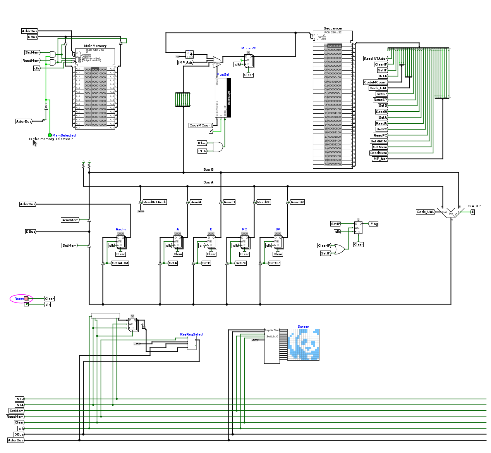

# Bonus: place aux jeux

--- 

{width=50%}

--- 

## Introduction 

Jusqu'à maintenant, nous avons travaillé sur des problèmes jouets pour illustrer différents concepts d'architecture. Je vous propose maintenant de laisser libre court à votre imagination et de programmer votre architecture. Rien de tel alors que de se lancer le défi de programmer un jeu. Alors, n'exagérons pas, notre architecture est limitée à bien des égards : 

- la fréquence d'horloge qui est dépendante de la fréquence à laquelle notre circuit peut être simulé n'excédera que difficilement le kHz (nos ordinateurs sont cadencés à une fréquence 10 000 000 fois plus grande), 
- on va ajouter un petit écran de 16x16 pixels monochrome et on va essayer de ne pas être exagérément ambitieux quand au jeu que nous devons écrire en assembleur. 

Mais soit, faisons avec;

Je vous propose d'utiliser l'architecture [archi_jeu.circ](https://raw.githubusercontent.com/jeremyfix/Architecture/refs/heads/main/TP-Evolution/archi_jeu.circ) ainsi que le microcode [microcode_jeu.rom](https://raw.githubusercontent.com/jeremyfix/Architecture/refs/heads/main/TP-Evolution/Microcodes/microcode_jeu.rom).

Comme nouveautés, j'ai ajouté deux nouvelles instructions :

- STAB (0x1800) : Place le contenu du registre A à l'adresse contenue dans le registre B : {++Mem[B] := A++}
- STBA (0x2800) : Place le contenu du registre B à l'adresse contenu dans le registre A : {++Mem[A] := B++}

Le programme Python assembleur `assemble.py` prends en compte ces deux nouvelles instructions. 

Au niveau des périphériques, notre mini console dispose:

- d'un clavier, qui signale la présence d'un caractère par interruption son buffer étant accessible en lecture à l'adresse 0x1003
- d'un écran de 16 x 16 pixels monochromes; un périphérique de sortie pour lequel on renseigne le contenu des lignes individuellement. Chaque pixel peut avoir l'état 0 ou 1. Une ligne pleine sera par exemple codée avec la valeur 0xFFFF

L'écran est couplé au chemin de données par l'intermédiaire d'un composant appelé pompeusement "CarteGraphique". N'hésitez pas à cliquer avec le "Poke Tool" sur ce composant pour inspecter son contenu. Pour des raisons pratiques de temps de simulation, vous disposez de deux implémentations, l'une purement en logisim, via le composant `CGraphicalCard_circ`, que vous pouvez inspecter et une autre codée directement en java dont vous ne pouvez pas directement voir les entrailles sous la forme d'un composant logique.

Notre carte graphique dispose de deux blocs de buffers, chaque bloc étant constitué de 16 registres 16 bits pour définir la couleur de chaque pixel de l'écran. Ces deux blocs de buffers constituent ce qu'on appelle du [double buffering](https://en.wikipedia.org/wiki/Multiple_buffering#Double_buffering_in_computer_graphics). Par la suite j'appelle buffer un bloc de 16 registres de 16 bits. 

On dispose donc de deux buffers. Sans double buffering, puisque chacune des lignes est adressée individuellement, on verrait visuellement la mise à jour progressive de chaque ligne et le rendu ne serait pas très agréable. Avec le double buffering, l'un de ces buffers, le front buffer, alimente l'écran. Pendant ce temps, on écrit une nouvelle image dans l'autre buffer, le back buffer. Une fois l'image complètement écrite en mémoire, on permute le rôle des front buffer et back buffer. On voit alors d'un coup, la nouvelle image. 

En pratique, le composant CarteGraphique dispose :

- d'une adresse de base, à fournir sur un bus d'entrée, par exemple la constante
  0x2000 sur l'architecture qui vous est fournie
- d'un registre de 1 bit adressable à l'adresse 0x2000 qui définit quel buffer est le front buffer et quel buffer est le back buffer
- de 16 registres 16 bits adressables à des adresses 0x2001, 0x2002, 0x2003, ... 0x2010

!!! warning

	Vous pouvez utiliser plusieurs écrans. Ils auront des plages d'adresses
	dépendantes de l'adresse de base que vous fournissez à l'entrée de votre
	composant.

	Si vous changez la constante 0x2000 par une autre valeur de base, les
	adresses des registres internes sont à adapter en conséquence.

Le registre pour sélectionner le buffer est de 1 bit, mais reste alimenté via le bus de données de 16 bits. En interne, seul le bit de poids faible est utilisé pour modifier le contenu de ce registre. Donc :

- {++LDAi 0000 ; STA 0x2000++} : sélectionne le buffer "de gauche" en front buffer et le buffer "de droite" en back buffer
- {++LDAi 0001 ; STA 0x2000++} : sélectionne le buffer "de gauche" en back buffer et le buffer "de droite" en front buffer

Pour utiliser ce système de double buffering, on remplira alors toute l'image en adressant toutes les lignes puis on terminera par permuter les front et back buffers pour déclencher l'affichage de l'image. A titre d'illustration, je vous propose ci-dessous une petite vidéo d'une réalisation d'un mini space invaders. Pendant la vidéo, les tirs sont générés en appuyant sur le touche "L", les touches "Q" et "D" déplacent la plateforme à gauche et à droite. Soyez patient, la video dure 5 minutes, ... le processeur est cadencé au mieux à 500 Hz. Je vous donne également le [code source en assembleur](https://raw.githubusercontent.com/jeremyfix/Architecture/refs/heads/main/TP-Evolution/ASM/jeu.asm) si vous souhaitez utiliser ce jeu comme point de départ.

<video controls autoplay loop width="100%">
<source src="../videos/archi-jeu.webm" type="video/webm" />

Download the <a href="../videos/archi-jeu.webm">WEBM</a>
video.
</video>

